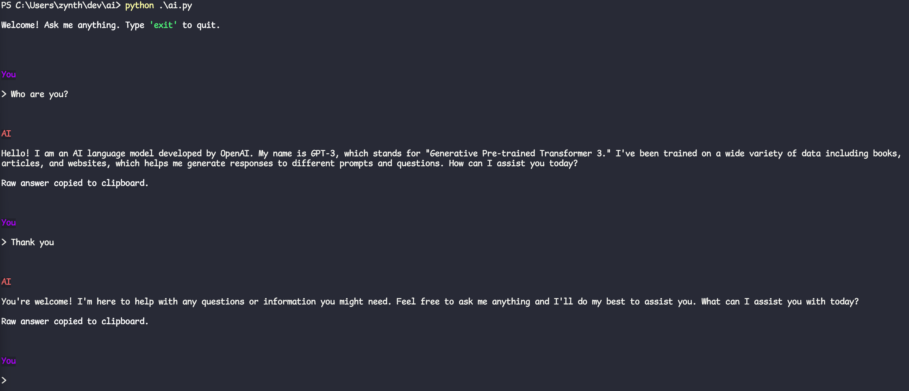

# Flowise AI API usage with Python

We created our own python script that allows us to ask questions from the terminal and get beautiful rich text results! It will automatically parse the markdown contents of our AI into beautiful text. 



## Usage

- You need to have [Flowise AI running locally](https://github.com/FlowiseAI/Flowise) in order for these to work. This is because we use Flowise AI API in our backend.

```bash
python ./ai.py "Show me code example of using @SpringBootApplication annotation in Kotlin, and compare it with Java"
```

## Dependencies

> You need Python 3 installed as set as the default python.

```bash
pip install rich
pip install pyperclip
```

## Code Example

```python
import sys
import requests
from rich import print
from rich.markdown import Markdown
from rich.console import Console

FLOWISE_API_URL = "http://localhost:3000/api/v1/prediction/dc866a6c-41bb-49b4-aa0f-e4c0adbecd53" # Your Flowise API URL here

def query(payload):
    response = requests.post(FLOWISE_API_URL, json=payload)
    return response.json()

def main():
    if len(sys.argv) < 2:
        print("Please provide a question!")
        return

    question = ' '.join(sys.argv[1:])
    output = query({"question": question})

    text = output["text"]
    console = Console()
    better_text = Markdown(text)
    print("\n")
    print(better_text)

if __name__ == "__main__":
    main()

```

-----

# MIT License

Copyright 2023 Zynth

Permission is hereby granted, free of charge, to any person obtaining a copy of this software and associated documentation files (the “Software”), to deal in the Software without restriction, including without limitation the rights to use, copy, modify, merge, publish, distribute, sublicense, and/or sell copies of the Software, and to permit persons to whom the Software is furnished to do so, subject to the following conditions:

The above copyright notice and this permission notice shall be included in all copies or substantial portions of the Software.

THE SOFTWARE IS PROVIDED “AS IS”, WITHOUT WARRANTY OF ANY KIND, EXPRESS OR IMPLIED, INCLUDING BUT NOT LIMITED TO THE WARRANTIES OF MERCHANTABILITY, FITNESS FOR A PARTICULAR PURPOSE AND NONINFRINGEMENT. IN NO EVENT SHALL THE AUTHORS OR COPYRIGHT HOLDERS BE LIABLE FOR ANY CLAIM, DAMAGES OR OTHER LIABILITY, WHETHER IN AN ACTION OF CONTRACT, TORT OR OTHERWISE, ARISING FROM, OUT OF OR IN CONNECTION WITH THE SOFTWARE OR THE USE OR OTHER DEALINGS IN THE SOFTWARE.